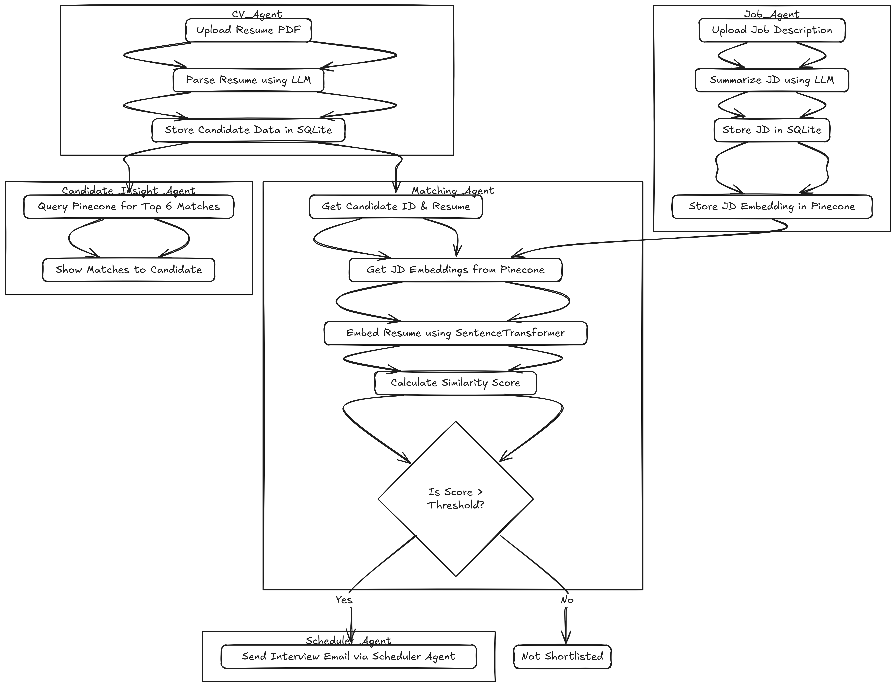

# Accenture Hackathon Submission  
## 🧠 Problem Statement 5: Enhancing Job Screening with AI and Data Intelligence  

### 🚀 Team: `EK_AUR`  

[Click here to watch the demo video](https://www.loom.com/share/70c88a77d61c4d92b8c1cb0fb4889824?sid=ed7fb51c-daed-42f8-8a79-dbcf70bdee61)

---

## 🔍 Problem Overview

The traditional recruitment process is time-consuming, error-prone, and inefficient, especially when manually parsing through hundreds of job descriptions (JDs) and candidate resumes. The goal was to create a **multi-agent AI system** that automates the full lifecycle of job screening — from parsing and matching to shortlisting and interview scheduling.

---

## 🛠️ Technologies Used

- **Language Models**: Google Gemini (via API) for job and resume summarization  
- **Resume Parsing**: PyMuPDF for structured text extraction from PDFs  
- **Semantic Search**: SentenceTransformers + Pinecone for vector similarity  
- **Database**: SQLite for long-term storage of structured candidate and job data  
- **Email Automation**: Python SMTP for sending personalized interview invites  
- **Multi-Agent Architecture**: Modular Python agents for each task  
- **Langchain**: For chaining prompt pipelines and orchestrating LLM reasoning  
- **Orchestration**: Langchain + Seamless Python scripting + REST APIs for agent interactions  

---

## 🧩 System Architecture

### 💡 Agents Involved

| Agent              | Function                                                                 |
|--------------------|--------------------------------------------------------------------------|
| **CV Agent**       | Parses resumes and extracts structured details (skills, edu, exp, etc.)  |
| **Job Agent**      | Summarizes JDs and stores them in SQLite + Pinecone                      |
| **Matching Agent** | Embeds candidate and JD details and computes similarity score           |
| **Scheduler Agent**| Sends interview invites if match score exceeds threshold                |
| **Insights Agent** | Provides top-6 job recommendations for each candidate using Pinecone    |

---

## ↺ Flowchart  

---

## 🌟 Features

✅ Resume PDF parsing and candidate data extraction  
✅ Job upload, summarization, and vector storage  
✅ Embedding-based candidate-job similarity matching  
✅ Threshold-based automatic shortlisting  
✅ Email invites with personalized scheduling  
✅ Top-match insights for each candidate  

---

## 🧪 How It Works

1. 📄 **Resume Uploaded** → CV Agent parses and stores data in SQLite  
2. 📝 **Job Uploaded** → Job Agent summarizes and stores in SQLite & Pinecone  
3. 🔍 **Matching Request** → Matching Agent calculates similarity using SentenceTransformers  
4. 📈 **Score Evaluated** → If above threshold → Scheduler sends an interview invite  
5. 📊 **Insights** → Pinecone returns top-6 matches per candidate  

---

## 👥 Team EK_AUR

A two-member team that believes in *doing more with less*. We built this multi-agent system to show how scalable, intelligent, and human-centric recruitment tech can be when powered by AI.
